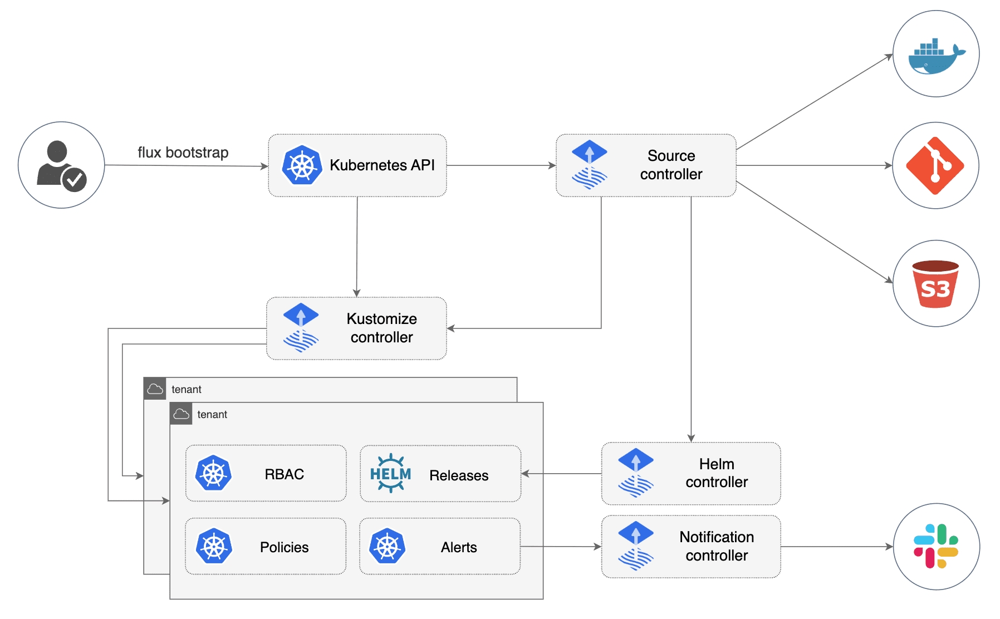

# FluxCD

This repository implements GitOps practices using FluxCD for managing Kubernetes deployments across different environments.

## NOTES

**Container images and Helm charts are registry-agnostic.** Every image reference,
chart source and registry secret name is a Flux post-build substitution variable with
an inline default pointing at the public `ghcr.io/bouc-io` artifacts. A cluster that
pulls from somewhere else only needs to override the relevant keys in `cluster-vars`
— no manifest edits. See [`cluster-vars` keys](#cluster-vars-keys) below.


## Forking this repository

This repository is published on GitHub as a **template you fork and own**. Nothing is pushed to
your fork from upstream and no generator produces it: fork it, then run it as your own GitOps
repository.

What a fork has to do, in the order the sections below present it:

1. Create a Git credential for **your** repository ([step 1](#1-install-fluxcd)).
2. Create the `cluster-vars` ConfigMap ([step 2](#2-set-up-the-main-cluster-variables)).
3. Create the secrets your components need ([step 3](#3-create-necessary-secrets)).
4. Bootstrap Flux against **your** repository, never this one
   ([step 4](#4-create-the-initial-fluxcd-configuration-via-bootstrap)).
5. Re-add `recurseSubmodules: true`, which bootstrap strips every time
   ([step 5](#5-re-apply-recursesubmodules-after-every-bootstrap)).
6. Wire `clusters/components/`, which is empty in the public snapshot
   ([details](#important-note-for-the-open-source-github-copy)).

The commands throughout this README are the upstream maintainer's own runbook and target GitLab.
Each step that differs for a GitHub fork carries a variant beside it. Note the branch difference
too: the upstream repository uses `master`, while the GitHub snapshot lands on `main`.


## Architecture



Note, refer to the fluxcd.io website at https://fluxcd.io/flux/concepts/ and https://fluxcd.io/flux/components/


## Repository Structure

Everything lives under `clusters/`. There is no top-level `infrastructure/` or `apps/` directory.

```shell
fluxcdboucio/
├── clusters/
│ ├── base/ # Environment-agnostic definitions
│ │ ├── infrastructure/ # HelmReleases for the cluster add-ons
│ │ └── apps/ # HelmReleases, ImageRepositories and ImagePolicies for the apps
│ ├── components/ # One directory per component repo (values files + raw manifests)
│ ├── local/ # Local environment: Kustomizations, overlays and patches over base
│ └── sandbox/ # Sandbox environment: same shape, GKE-targeted
└── README.md
```

`clusters/components/` is where each component's own repository is attached. It is empty in the
public GitHub snapshot, on purpose: see
[Important Note for the Open-Source (GitHub) Copy](#important-note-for-the-open-source-github-copy).


## Important Note for the Open-Source (GitHub) Copy

On the private GitLab origin (the source of truth), each component under `clusters/components/<name>`
is a **Git submodule** pointing to that component's own repository. Flux syncs them with
`recurseSubmodules: true` and generates each component's ConfigMaps from the values files inside
(see "Notes - ConfigMap generation and setup" below).

The public snapshot at https://github.com/bouc-io/fluxcdboucio is published **without** the
`.gitmodules` file and without those submodule links — so if you cloned this from GitHub, the
`clusters/components/` directories are empty. Every component is available as its own repository
under the same organization (https://github.com/bouc-io — e.g. `keycloak`, `oauth2-proxy`, `istio`,
`cert-manager`, `agent-api`, `memory-api`, ...). To reconstruct the layout, re-add the components
you need as submodules pointing at your own forks:

```shell
git submodule add https://github.com/<your-org>/<component>.git clusters/components/<component>
```

Two constraints to respect: Flux authentication requires the HTTP(S) submodule URL (not the SSH
`git@` form), and `recurseSubmodules: true` must be re-added to the `GitRepository` spec after every
bootstrap (see [step 5](#5-re-apply-recursesubmodules-after-every-bootstrap)).

### Component directory to repository mapping

The directory name under `clusters/components/` does not match the repository name for 14 of the
26 components, so the mapping is not guessable. Repositories live under
`https://github.com/bouc-io/<repo>`.

| `clusters/components/<path>` | Repository |
|---|---|
| `admin-api` | `admin-api-chart` |
| `admin-ui` | `admin-chart` |
| `agent-api` | `agent-api-chart` |
| `agent-ui` | `agent-chart` |
| `apidocs-api` | `apidocs-api-chart` |
| `cert-manager` | `cert-manager` |
| `chatbot-api` | `chatbot-api-chart` |
| `chatbot-ui` | `chatbot-chart` |
| `datadog` | `datadog` |
| `external-dns` | `external-dns` |
| `external-secrets` | `external-secrets` |
| `grafana` | `grafana` |
| `istio` | `istio` |
| `keycloak` | `keycloak` |
| `kiali` | `kiali` |
| `memory-api` | `memory-api-chart` |
| `memory-distiller` | `memory-distiller-chart` |
| `memory-ui` | `memory-chart` |
| `metrics-server` | `metrics-server` |
| `oauth2-proxy` | `oauth2-proxy` |
| `ollama` | `ollama-chart` |
| `opentelemetry` | `opentelemetry` |
| `portal-api` | `portal-api-chart` |
| `portal-ui` | `portal-chart` |
| `prometheus` | `prometheus` |
| `web-ui` | `web-chart` |

### Alternative: vendor the components instead

Submodules are not mandatory. Copying each component repository's contents straight into
`clusters/components/<path>/` as ordinary directories works exactly the same way, since Flux only
reads the files. Choose this if you would rather manage the components as part of your own repo.
With vendored directories, `recurseSubmodules` is unnecessary and step 5 does not apply to you.


## 1. Install FluxCD

Since we're planning to enable the "image update automation" provided, use the following bootstrap command after setting up your GitLab key (i.e GITLAB_TOKEN environment variable):

First, create a "deploy token" (or "pat", a "personal access token") at the group level on the GitLab UI, providing all necessary access to the token:
- read_repository
- read_registry
- write_registry
- read_package_registry
- write_package_registry

Copy the password provided (it should start with 'glpat-...").

Note, if the token ever expires, you can always generate a new one and use the following command to replace the FluxCD token:
```shell
flux create secret git flux-system \                                         
  --url=https://gitlab.com/bouc-io/fluxcd/fluxcdboucio.git # Replace with your GitLab repository URL if necessary \
  --username=<username> # Replace with your GitLab username if necessary \
  --password=<gl-token> \
  --namespace=flux-system \
  --export | kubectl apply -f -
```

Second, run the following command:
```shell
export $GITLAB_TOKEN=<gl-token>
```

Note, since we use the "master" branch, which by default is a protected branch in GitLab, to push all changes for the ImageUpdateAutomation, you need to modify the list of "protected branches" on the FluxCD Git repository to allow the FluxCD user to push commit to the 'master' branch.  This configuration can be found under the Settings > Repository, within the "Protected Branches" section. This paragraph is GitLab-specific.

### GitHub fork: credential

Create a personal access token with the `repo` scope on your own account or organization, then:

```shell
export GITHUB_TOKEN=<your-pat>
```

`flux bootstrap github` uses that token to create the deploy key and commit the Flux manifests to
your fork. If your fork protects its default branch, allow the Flux identity to push to it, or
image update automation cannot commit new tags.


## 2. Set up the main cluster variables

Then run the following kubectl command:
```shell
kubectl create namespace flux-system
kubectl create configmap cluster-vars -n flux-system \
  --from-literal=CLUSTER_DOMAIN=<DOMAIN> \
  --from-literal=CLUSTER_NAME=<CLUSTER_NAME> \
  --from-literal=ENVIRONMENT_ID=local \ ## Or sandbox
  --from-literal=GCP_PROJECT_ID=<GCP_PROJECT_ID> ## sandbox only — see below
```

Notes:
- If selecting "local" as the environment_id, in other words building a cluster locally, the cluster_domain should be set to the appropriate domain for the local cluster and ensure your local "/etc/hosts" file (for Mac) has the domain and IP address properly configured.  External DNS will not have any setup or effect for a "local" customer.
- In the case of "sandbox", domain should be a valid domain you own with proper configuration within Google Cloud Platform (i.e. Cloud DNS zone configured with service account).
- Domain for local can be any preferred domain.

### `cluster-vars` keys

These keys are exposed to manifests via Flux `postBuild.substituteFrom: cluster-vars`
(referenced by the `*-infra`, `*-config`, cert-certificates and ESO `*-eso-stores`
Kustomizations). Reference them in manifests as `${KEY}`.

| Key | Required | Used by |
|---|---|---|
| `CLUSTER_DOMAIN` | always | ingress/DNS hostnames |
| `CLUSTER_NAME` | always | cluster identification |
| `ENVIRONMENT_ID` | always | `local` or `sandbox` overlay selection |
| `GCP_PROJECT_ID` | **sandbox only** | External Secrets Operator — substituted into the sandbox GCP Secret Manager `ClusterSecretStore` (`projectID`) and into the Workload Identity ServiceAccount annotation in `external-secrets/snbx.values.yaml` (`eso-gke@${GCP_PROJECT_ID}.iam.gserviceaccount.com`). The GCP-side Secret Manager + IAM/Workload Identity setup is manual — see `infrastructure/external-secrets/README.md`. |
| `IMAGE_REGISTRY` | optional | Container image host+org prefix. Default `ghcr.io/bouc-io`. |
| `CHART_REGISTRY` | optional | OCI base path for the shared `boucio-charts` HelmRepository. Default `ghcr.io/bouc-io/charts`. |
| `REGISTRY_SECRET` | optional | Name of the registry credential secret (image pulls, image scanning, chart pulls). Default `registry-credentials`. |
| `REGISTRY_HOST` | optional | Bare registry hostname for the Istio `allow-registry-egress` ServiceEntry. Default `ghcr.io`. |
| `IMAGE_TAG_RANGE` | optional | Semver range the `ImagePolicy` objects track. Default `x.x.x`; pin to `1.0.x` to keep automation on the current tag series. |

> If `GCP_PROJECT_ID` is unset on a sandbox cluster, Flux substitution leaves the
> field blank and the ESO sandbox `ClusterSecretStore` will fail to authenticate.
> It is not needed locally (the local store uses ESO's Kubernetes provider).

#### Registry overrides

The five registry keys are optional because each reference in the manifests carries an
inline default (`${IMAGE_REGISTRY:=ghcr.io/bouc-io}`). Leave them unset to consume the
public ghcr.io artifacts. To pull from the GitLab registry instead, add:

```shell
kubectl create configmap cluster-vars -n flux-system \
  --from-literal=CLUSTER_DOMAIN=<DOMAIN> \
  --from-literal=CLUSTER_NAME=<CLUSTER_NAME> \
  --from-literal=ENVIRONMENT_ID=local \
  --from-literal=IMAGE_REGISTRY=registry.gitlab.com/bouc-io \
  --from-literal=CHART_REGISTRY=registry.gitlab.com/bouc-io/charts \
  --from-literal=REGISTRY_HOST=registry.gitlab.com \
  --from-literal=IMAGE_TAG_RANGE=1.0.x
```

> Editing the `cluster-vars` ConfigMap does not itself trigger a reconcile. Run
> `flux reconcile kustomization <env>-apps --with-source` after changing it.

Note that a variable referenced **without** an inline default renders as an empty
string when the key is missing, so always keep the `:=` form when adding new ones.

#### Third-party images

`IMAGE_REGISTRY` only relocates the bouc.io application images. The bundled
dependencies still pull from Docker Hub: the Bitnami PostgreSQL and Redis subcharts
(currently the unmaintained `bitnamilegacy` archive namespace), `pgvector/pgvector`,
and `ollama/ollama`. Behind a restricted network or Docker Hub rate limits, relocate
them one of three ways:

- **Per chart** — every application chart honours `global.imageRegistry`, which
  rewrites the host+org prefix for the app container *and* its Bitnami subcharts:
  `--set global.imageRegistry=myregistry.example.com/mirror`.
- **Cluster-wide policy** — a Kyverno `replace-image-registry` mutating policy
  rewrites image references for every pod, including ones no chart value reaches.
- **Node-level** — containerd registry mirrors (`hosts.toml`) redirect `docker.io`
  transparently, with no manifest or chart changes at all.


## 3. Create necessary secrets

One credential name, `registry-credentials` (or whatever `REGISTRY_SECRET` is set to),
covers all three registry consumers: image-reflector scanning the container tags
(`flux-system`), source-controller pulling charts from the OCI `boucio-charts`
repository, and the pods pulling their images (`default`). Both must be
`dockerconfigjson`, so create one per namespace.

### Creating the GitLab deploy token

Only needed when `REGISTRY_HOST` / `IMAGE_REGISTRY` / `CHART_REGISTRY` are overridden to
`registry.gitlab.com`. For the public ghcr.io default, skip to the empty-auth form below.

It must be a **group** deploy token on `bouc-io`, not a project one: the same credential
has to reach all 13 image projects plus the `bouc-io/charts` registry, and a project
deploy token is scoped to a single project.

1. Go to the **`bouc-io` group** → **Settings** → **Repository** → **Deploy tokens**.
2. **Name:** something identifying the consumer, e.g. `k8s-registry-pull`.
3. **Expiration date:** optional. If set, put a reminder somewhere: the clusters stop
   pulling images on that date, and the failure looks like `ImagePullBackOff` rather than
   an auth error.
4. **Username:** optional. Leave it blank and GitLab generates
   `gitlab+deploy-token-<id>`; whatever it ends up as is the `--docker-username` below.
5. **Scopes:** tick **`read_registry`** only. That covers all three consumers, because image
   tag scanning, OCI chart pulls, and pod image pulls are all reads against the container
   registry. Do not grant `write_registry`.
6. **Create deploy token**, then copy the value. GitLab shows it once.

> `read_package_registry` is deliberately not needed, here or anywhere else in the project. It
> covers the per-project HTTP Helm package registry, which CI no longer publishes to and nothing
> consumes — charts come from the OCI `boucio-charts` repository in the container registry.

This token is one of several in the project and they are not interchangeable:

| Credential | Scopes | Used by |
|---|---|---|
| `registry-credentials` (this one) | `read_registry` | The clusters, to pull images and charts |
| `CHARTS_DEPLOY_USER` / `CHARTS_DEPLOY_TOKEN` | `read_registry` + `write_registry` | Chart repo CI, to `helm push` to `bouc-io/charts` |
| `GITLAB_TOKEN_USER` / `GITLAB_TOKEN_PWD` | `read_registry` | `publish-to-ghcr.sh`, artifact promotion |
| `GITLAB_TOKEN` | `api` (personal access token) | `flux bootstrap`, for Git access to this repo |

### Creating the secret

For a private registry:
```shell
for ns in flux-system default; do
  kubectl create secret docker-registry registry-credentials \
    --namespace=$ns \
    --docker-server=<REGISTRY_HOST> \
    --docker-username='<username bot>' \
    --docker-password='<token password>' \
    --cluster $BOUCIO_CLSTR_FULLNAME
done
```

For the public ghcr.io default, no credentials are needed — but the secret must still
exist, because a `secretRef` cannot be removed by substitution. Create it with an empty
auth map so the registry clients fall back to anonymous access:
```shell
for ns in flux-system default; do
  kubectl create secret generic registry-credentials \
    --namespace=$ns \
    --type=kubernetes.io/dockerconfigjson \
    --from-literal=.dockerconfigjson='{"auths":{}}' \
    --cluster $BOUCIO_CLSTR_FULLNAME
done
```

> If anonymous scanning misbehaves against ghcr.io, substitute a GitHub PAT with the
> `read:packages` scope using the private-registry form above — no manifest change.

When creating the FluxCD setup for the local cluster, switch the cluster to the proper cluster name (in our case, most likely "docker-desktop").


## 4. Create the initial FluxCD configuration via bootstrap 

### GitHub fork: bootstrap

Bootstrap against **your own** repository. Never point a bootstrap at the upstream repository.

```shell
flux bootstrap github \
  --owner=<your-github-org> \
  --repository=<your-fork> \
  --branch=main \
  --path=clusters/local \
  --components=source-controller,kustomize-controller,helm-controller,image-reflector-controller,image-automation-controller \
  --personal=false
```

Use `--path=clusters/sandbox` for the sandbox overlay, or a new `clusters/<name>` directory copied
from one of them for a differently named environment.

### What bootstrap writes, and why gotk-sync.yaml names someone else's repository

`flux bootstrap` generates and commits three files into `clusters/<path>/flux-system/`:
`gotk-components.yaml`, `gotk-sync.yaml`, and `kustomization.yaml`. Do not hand-edit them, with the
single exception in step 5.

`gotk-sync.yaml` holds a `GitRepository` (repository URL, branch, and a `secretRef`) plus a
`Kustomization` whose `path` is that same cluster directory. The repo tells the cluster where the
repo is, which is why the committed copies here carry the upstream maintainer's GitLab URL and the
`master` branch.

That value is inert for you:

- nothing reads a `gotk-sync.yaml` except the cluster that bootstrapped that exact path, and your
  bootstrap rewrites the file with your URL, your branch and your path before that can happen
- a cluster directory nobody bootstrapped is never evaluated at all
- the `flux-system` Secret holding the deploy key is created in the cluster by bootstrap. It is
  never committed, so no credential ships in this repository
- if you skip bootstrap and apply the file by hand, you get a visible `GitRepository` authentication
  failure in `flux get sources git`, not a silent misbehavior

### Upstream maintainer's runbook (GitLab)

Then run the following FluxCD bootstrap command:
```shell
flux bootstrap gitlab \
  --token-auth=true  \
  --read-write-key=true \
  --owner=bouc-io/fluxcd \
  --repository=fluxcdboucio \
  --branch=master \
  --path=clusters/sandbox \
  --components=source-controller,kustomize-controller,helm-controller,image-reflector-controller,image-automation-controller \
  --visibility=private --personal=false --author-name "Martin Cote" --author-email "martin.cote@gmail.com" --verbose \
  --cluster $BOUCIO_CLSTR_FULLNAME
```

For the local setup of Flux CD on a docker-desktop Kubernetes cluster, run the following command:
```shell
flux bootstrap gitlab \
  --token-auth=true  \
  --read-write-key=true \
  --owner=bouc-io/fluxcd \
  --repository=fluxcdboucio \
  --branch=master \
  --path=clusters/local \
  --components=source-controller,kustomize-controller,helm-controller,image-reflector-controller,image-automation-controller \
  --visibility=private --personal=false --author-name "Martin Cote" --author-email "martin.cote@gmail.com" --verbose \
  --cluster docker-desktop
```

Note make your context is the appropriate for the command you are running; i.e. run kubectx with the cluster you're targeting.


## 5. Re-apply recurseSubmodules after every bootstrap

Applies only if you wired `clusters/components/` as Git submodules. If you vendored the component
directories instead, skip this step entirely.

When FluxCD is initially bootstrapped, it removes any recursive submodule configuration to avoid problems.  As such, in this specific configuration, you have to re-install and reapply it.

**This fails silently, which is why it matters.** With the line missing, the `GitRepository` still
reports Ready, every Kustomization still reconciles, and the cluster looks healthy. The only symptom
is that nothing under `clusters/components/` is ever synced, so the generated values ConfigMaps are
empty or stale and HelmReleases quietly run on old values. Re-check it after **every** bootstrap
run, not just the first.

Modify the gotk-sync.yaml file of the cluster just installed by adding the following line:
```yaml
  recurseSubmodules: true # This is needed to sync the submodules (e.g. keycloak, oauth2-proxy, istio)
```

In the following location:
```yaml
apiVersion: source.toolkit.fluxcd.io/v1
kind: GitRepository
metadata:
  name: flux-system
  namespace: flux-system
spec:
  interval: 1m0s
  ref:
    branch: master
  secretRef:
    name: flux-system
  url: https://gitlab.com/bouc-io/fluxcd/fluxcdboucio.git
  recurseSubmodules: true # This is needed to sync the submodules (e.g. keycloak, oauth2-proxy, istio)
```

Verify it took effect on the cluster:

```shell
kubectl -n flux-system get gitrepository flux-system -o yaml | grep recurseSubmodules
```

No output means the line is missing and the components are not syncing.


## Notes - ConfigMap generation and setup

The FluxCD Git repo is using and leveraging a recursive model using Git submodule to point to each "component" Git repo for their respective configuration at each level.  Those submodules are linked within the main repo and referred to create a configmap using the configmapgenerator for each.


### Warning

- First, if you want to create those Git submodules, because of FluxCD authentication mechanism with GitLab, you have to ensure you link to the HTTP URL (and NOT the git@git SSH URL).
- Second, the bootstrap step strips `recurseSubmodules` out of `gotk-sync.yaml` every time it runs.
  The full explanation, the silent failure mode, and the verification command are in
  [step 5](#5-re-apply-recursesubmodules-after-every-bootstrap).


## Values ConfigMaps

There is no manual step here. Each component's values ConfigMaps are generated by the
`configMapGenerator` block in `clusters/{local,sandbox}/config/kustomization.yaml`, reading
`base.values.yaml` and the environment file (`lcl.values.yaml` or `snbx.values.yaml`) out of
`clusters/components/<component>/`. The HelmReleases consume them through `valuesFrom:`.

Adding a component means adding its generator entry there, not running `kubectl create configmap`.

For those requiring a secret (currently OAuth2-proxy and Keycloak), refer to their documentation, section for the "sandbox" installation, and create the secret from the "kubectl" command provided in the instructions.


## Environment Management

- **Sandbox Environment**: Located in `clusters/sandbox/`
- **Local Environment**: Located in `clusters/local/`

> **The `local` overlay ships known, published credentials on purpose.** Its values files carry
> plaintext passwords, and the ESO local store is a committed plaintext Secret. That is deliberate:
> `local` targets a homelab cluster that is not reachable from the internet. If you point a
> reachable cluster at the `local` overlay, you own that decision. Use `sandbox` as the model for
> any environment where the credentials have to be real.


## Infrastructure Components

Cluster add-ons are defined in `clusters/base/infrastructure/` (one `fluxcd-<name>.yaml` per
add-on, holding its Namespace, HelmRepository and HelmRelease). Each environment then patches them
from `clusters/local/infrastructure/` or `clusters/sandbox/infrastructure/`, and the values come
from the ConfigMaps generated out of `clusters/components/<name>/`.


## Application Components

Applications follow the same shape in `clusters/base/apps/`, with the per-environment overlays in
`clusters/{local,sandbox}/apps/`. Adding an application means adding its base definition, its
environment patch, and its `configMapGenerator` entry (see "Values ConfigMaps" above).


## How to work locally

The original setup for the "local" cluster installs every component from the remote repositories at
the latest published version. When working locally on one component, modify that component's local
overlay so the HelmRelease points at your locally built image name and tag, then apply the overlay
by hand with `kubectl apply -f`.

### Example

Modify the chart's YAML configuration for the local overlay (the files under
`clusters/local/apps/examples/`, one `fluxcd-<component>-chart.yaml` per component), from:
```shell
    image:
      registry: ${IMAGE_REGISTRY:=ghcr.io/bouc-io}
      imagePullPolicy: IfNotPresent
      # Dynamic tag to be updated by Image Automation
      tag: "1.0.1686424642" # {"$imagepolicy": "flux-system:api-chart-imgpolicy:tag"}
    imagePullSecrets:
      - name: ${REGISTRY_SECRET:=registry-credentials}
```

To:
```shell
    image:
      registry: "" # Empty registry -> bare image name from the local Docker daemon
      repository: api-example
      imagePullPolicy: Never # Ensure to take the container image from the local registry
      tag: "0.3.42" # Remove imagepolicy for local setup - Use local tag
```
Note, use the proper values for 'repository' and 'tag' from your specific and tag locally.

Then apply the local overlay with this command:
```shell
kubectl apply -f clusters/local/apps/examples/fluxcd-agent-api-chart.yaml
```


## Rollback

### Rollback to a specific commit
```shell
flux reconcile helmrelease static-web-helmrelease --namespace default --revision=<commit-hash> --verbose
```

### Rollback to previous version
```shell
flux reconcile helmrelease static-web-helmrelease --revision=previous
```


## Troubleshooting Guides

### Common error messages and solutions


### How to check FluxCD logs:
```shell
flux logs
```

### How to check reconciliation status:

For the local cluster:
```shell
flux get all --all-namespaces --cluster docker-desktop --context docker-desktop
```

Or the sandbox cluster:
```shell
flux get all --all-namespaces --cluster $BOUCIO_CLSTR_FULLNAME --context $BOUCIO_CLSTR_FULLNAME
```

### How to watch convergence after a bootstrap:

Right after `flux bootstrap`, follow the Kustomizations until they all report Ready:
```shell
flux get kustomizations --watch
```

Expect transient failures for the first few minutes: `*-eso-stores` applies a
`ClusterSecretStore` before the External Secrets CRDs are registered, and retries on
its 5m interval until they are. It self-heals. What should NOT self-heal is a
substitution error naming an undefined variable: that means a key is missing from
`cluster-vars` (see [`cluster-vars` keys](#cluster-vars-keys)).

### How to force reconciliation:

Example for one helmrelease object:
```shell
flux reconcile helmrelease static-web-helmrelease --namespace default --verbose
```


## Notes

- Charts are consumed as OCI artifacts from the single `boucio-charts` HelmRepository in the container registry. The per-project HTTP Helm package registry this project originally used is retired: chart CI no longer publishes to it and nothing reads from it.
- Special handling is required for components requiring secrets (OAuth2-proxy and Keycloak)


## References

1. https://fluxcd.io/flux/guides/repository-structure/
2. https://fluxcd.io/flux/guides/helmreleases/
3. https://docs.gitlab.com/ee/user/clusters/agent/gitops/flux_tutorial.html
4. https://fluxcd.io/flux/components/source/helmrepositories/
5. https://docs.gitlab.com/ee/user/packages/container_registry/
6. https://docs.gitlab.com/ee/user/clusters/agent/gitops.html
7. https://docs.gitlab.com/ee/user/clusters/agent/gitops/flux_tutorial.html
8. https://trstringer.com/install-istio-flux/
9. https://istio.io/latest/docs/setup/install/helm/
10. https://github.com/solo-io/GitOps-with-Flux-and-Istio/blob/main/infrastructure/apps/base-apps/istio/4-helm-release-istiod.yaml
11. https://fluxcd.io/flagger/tutorials/istio-progressive-delivery/
12. https://github.com/ywarezk/academeez-k8s-flux
13. https://fluxcd.io/flux/guides/image-update/
14. https://github.com/fluxcd/helm-controller/issues/701
15. https://github.com/fluxcd/helm-controller/issues/806
16. https://geek-cookbook.funkypenguin.co.nz/recipes/kubernetes/oauth2-proxy/
17. https://geek-cookbook.funkypenguin.co.nz/recipes/kubernetes/keycloak/
18. https://github.com/fluxcd/flux2/discussions/4297
19. https://github.com/red-devops/FluxCD/tree/main
20. https://fluxcd.io/flux/installation/bootstrap/gitlab/
21. https://fluxcd.io/flux/use-cases/helm/
22. https://fluxcd.io/flux/guides/helmreleases/
23. https://github.com/helm/helm/issues/12062
24. https://fluxcd.io/flux/components/source/ocirepositories/
25. https://fluxcd.io/flux/components/helm/helmreleases/
26. https://fluxcd.io/flux/components/kustomize/api/v1/
27. https://medium.com/@I_am_zee/customising-kubernetes-resource-configurations-with-kustomize-199e99bf7a60
28. https://github.com/fluxcd/flux2-kustomize-helm-example/blob/main/README.md

## License

[Elastic License 2.0](./LICENSE) — source-available; not OSI open source.
